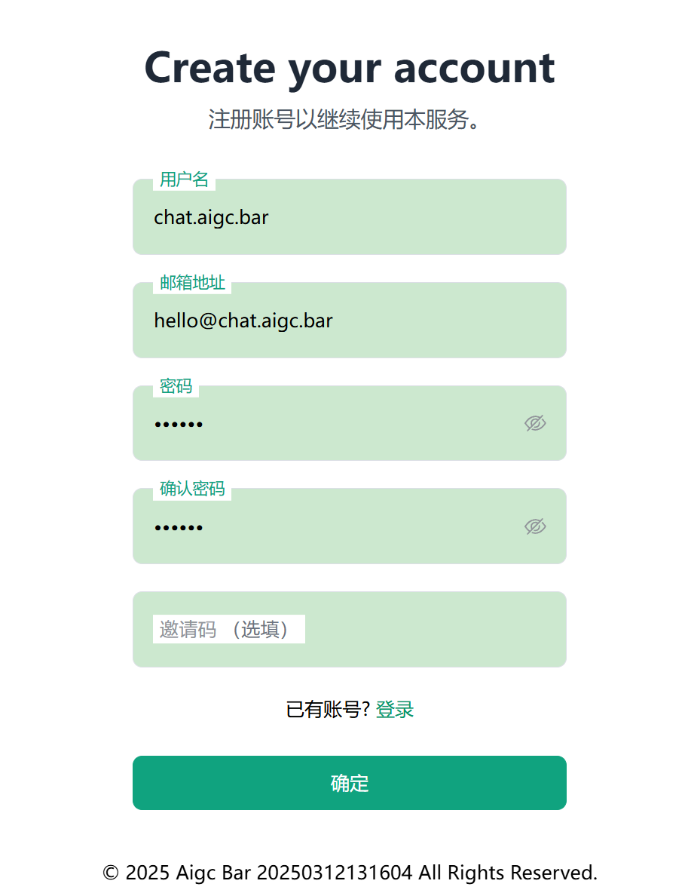

# ✨ 最新Claude Pro订阅教程：国内如何访问Claude？国内如何顺畅使用Claude？如何购买Claude Pro会员帐号？国内超赞Claude镜像推荐✨

---

## 🌟 Claude是什么？Claude有次数限制？Claude Pro是什么？Claude Pro怎么样？

### Claude是什么？🤔
Claude是Anthropic公司打造的一款超强AI对话模型，目标是提供自然、智能的语言生成和理解体验。它不仅减少偏见、提升安全性，还优化了人机交互，简直是AI界的“贴心小助手”！💡 最新版本Claude Sonnet 3.7在复杂指令、多轮对话和长文本处理上表现炸裂，支持高达200K tokens的上下文长度，远超ChatGPT Plus的GPT-4（32K tokens）。无论是大数据分析还是文档生成，Claude都能轻松驾驭！📊

### Claude有次数限制？⏳
免费版Claude确实有次数限制，每天大约20次交互，单次上下文处理也有上限。普通用户偶尔用用还行，但要是高频使用或处理长文本，免费版就有点“力不从心”啦。😅 为了解决这个问题，Anthropic推出了Claude Pro，解锁更多次数和更强功能，后面会详细聊聊！👇

### Claude Pro是什么？🚀
Claude Pro是Anthropic的付费订阅服务，基于Claude Sonnet模型，专为解除免费版限制而生。它不仅交互次数更多，响应速度更快，还能处理超大规模文本。据官方说，Claude Pro的上下文能力是免费版的3倍以上，还优先接入高速节点，即使高峰期也稳如老狗！🐶 对于需要深度处理的硬核用户来说，Claude Pro简直是“神器”！

### Claude Pro怎么样？👍
一句话：超值！数据分析师用它能轻松归纳万字文档，内容创作者能生成逻辑清晰的文案，商业用户也能靠它解决跨行业难题。相比其他工具，Claude Pro在速度、上下文理解和服务稳定性上都有一席之地，性价比超高！💸

---
## 🗽 在国外如何注册Claude？

在国外注册Claude其实超简单！只要准备好以下“四件套”，分分钟搞定！✨ 快来看看吧！👇

- 📧 **一个干净的Gmail邮箱**：没有邮箱？自己动手注册一个，so easy！或者直接买个现成的也行～（不知道去哪儿买？加我们微信咨询，秒回你哦！😉）  
- 🌐 **稳定的科学上网工具**：这可是重中之重！🔑 强烈建议挑一个靠谱的美国节点工具，稳定又快速！具体咋选就不多说啦，自己摸索一下哈～  
- 💳 **一张国外虚拟信用卡**：注意！Claude不认国内信用卡/银行卡，连港澳的都不行！😢 所以得备一张国外信用卡噢🚀  
- 📱 **一个国外手机号**：注册Claude必须手机验证，可惜+86号码完全没戏！🙅‍♂️ 别慌，后文会详细告诉你怎么轻松解决这个难题！👍  

有了这“四大法宝”，在国外注册Claude就是小菜一碟啦！🎉

---

## 🌍 国内如何访问Claude？

由于防火长城的限制，中国大陆的小伙伴们无法直接访问Claude官网（跟Google、ChatGPT一样，简直是“海外天团”标配！😂）。不过别担心，小编在这儿给大家推荐一个超赞的Claude镜像站服务商：<a href="https://chat.aigc.bar/list/#/home">chat.aigc.bar</a>！⚙️ 这个站点支持自助选车、自助换车，还能一键备份数据，再也不用担心Claude账号被风控时“欲哭无泪”啦！😭➡️😊

**小贴士**：这个站点服务真的绝了！💯 工单响应快如闪电⚡，访问速度更是嗖嗖的，体验感满分！在此疯狂打call，强烈推荐给大家！💐✨

---

## 🛒 Claude国内使用流程：如何使用Claude镜像里的Claude Pro现成账号？

自己注册太麻烦？直接买个购买使用Claude Pro账号也是个选择！这里小编推荐<a href="https://chat.aigc.bar/list/#/home">https://chat.aigc.bar</a>，服务态度好，靠谱有保障！🌟

1. **打开官网并登录**  
   地址：<a href="https://chat.aigc.bar/list/#/home">https://chat.aigc.bar</a> 
   用邮箱注册即可登录。📲  
   

2. **选择套餐后点击Claude**  
   点“开始使用” > “Claude Pro”。🛠️  
    

3. **点击相应的车辆，开始使用**  
   根据需求挑 Claude 3.7 Sonnet 或 Opus ⚙️   
    

搞定！输入问题，秒得智能回答！💬 

---

## 🤝 Claude Pro合租共享账号值得尝试吗？

老实说，真心推荐给大家试试！咱们先来聊聊Claude Pro的那些“小烦恼”：自己注册账号虽然自由，但总有封号的“隐形炸弹”埋着，一不小心账号没了，数据也可能跟着“人间蒸发”，想想都心痛！😭 再加上注册和维护的各种繁琐步骤，真的是既费时又费力。但如果你选择Claude Pro合租共享账号，干脆用Claude镜像服务，这些问题统统可以抛到脑后！✨ 不仅省心省力，还能享受到超多贴心功能，简直是懒人和效率控的福音！💪

---

## 🇭🇰 中国的港澳地区能用Claude吗？

不能！虽然港澳不受防火长城限制，但Claude没向中国开放，港澳也包括在内。想用还得走国外手机号+虚拟信用卡的路子，保持稳定美国节点哦！🌐

---

## 🗑️ Claude如何删除历史记录？

想保护隐私？删除记录超简单！登录后进“历史记录”，点“删除”清单条，或“清除所有记录”全搞定！小贴士：Claude镜像站自带会话隔离功能噢，不惧隐私泄露~✂️

---

## 🚫 Claude封号严重吗？Claude封号了怎么办？

封号确实挺常见，原因多是IP不稳、注册信息有问题或违反政策。  
**预防**：用稳定美国节点，信息真实合规，严格守规。  
**解封**：邮件“support[@]anthropic.com”申诉，提供注册和支付信息，耐心等回复。成功率看运气，不行就重注册吧！😅

> **小贴士**  
> 超好用的<a href="https://chat.aigc.bar/list/#/home">https://chat.aigc.bar</a>镜像站👩‍🏫不仅提供Claude Pro的基本功能，还加了些“彩蛋”：自动备份、文档导出、自助选号、自助换号、甚至多设备同步，无视风控✅”

---

## 数据隐私与安全性须知 ⚠️

1. **敏感信息保护**  
   别输入身份证、银行卡等隐私信息 🚫  
2. **网络安全**  
   优先选 HTTPS 加密站点，通信更安全 🔒  
3. **数据处理**  
   Claude 有严格保护机制，数据安全有保障 ✅  
4. **合规使用**  
   遵守法律法规，别干违法的事儿！⚖️  

---

© 2025 Claude AI 中文指南 | 用 Claude 点亮生活 🌟
